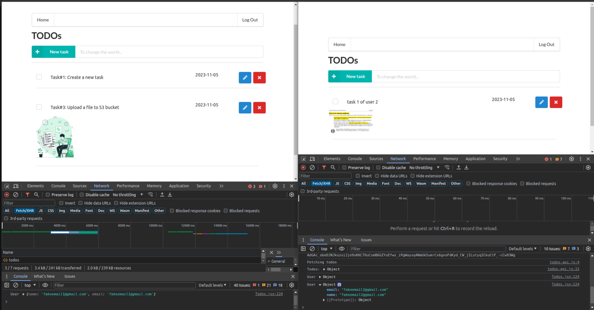
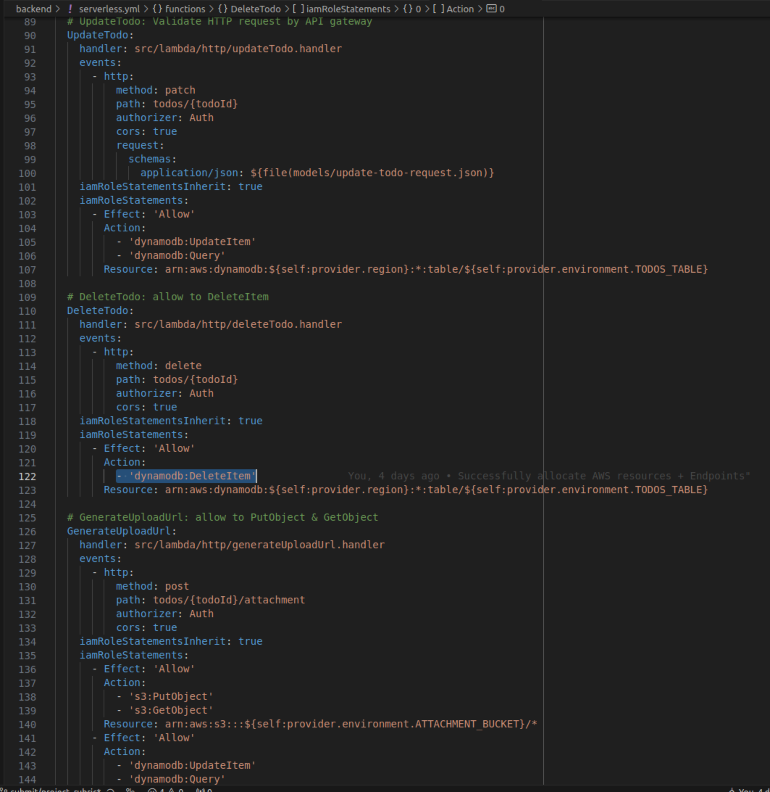

# Project: Serverless TODO Application
The project is based on the given environment variables in the **./client/.env** file as below:

```sh
REACT_APP_AUTH0_DOMAIN=dev-oery5ndggggtcgox.us.auth0.com
REACT_APP_AUTH0_CLIENT_ID=Ud7HCLmUzcbkPamP6LdX9R8UApAIS8J5
REACT_APP_API_ENDPOINT=https://q59dcyvvgj.execute-api.us-east-1.amazonaws.com/dev
```
Please copy-paste the above variables to your ***./client/.env*** file

## I. Functionality

1. **The application allows users to create, update, delete TODO items**

   - CREATE TODO Item: 
     - We can see a **POST** request method to a "*REACT_APP_API_ENDPOINT/todos*" path.
     - Serverless backend' API returned a **HTTP 201 status code**.
     - Client frontend displays a new task
     
     <p align="center">
       
     </p>


   - UPDATE TODO Item:
     - We can see a **PATCH** request method to a *REACT_APP_API_ENDPOINT/todos/{todoId}*.
     - Serverless backend' API returns a **HTTP 200 status code**.
     - Client frontend shows a check in the box
     <p align="center">
       
     </p>


   - DELETE TODO Item:
     - We can see a **DELETE** request method to a *REACT_APP_API_ENDPOINT/todos/{todoId}*.
     - Serverless backend' API returns a **HTTP 200 status code**.
     - Client frontend doesn't show task#2 anymore
     <p align="center">
       
     </p>


2. **The application allows users to upload a file.**

   - We can see a **PUT** request method to a *Pre-signed URL*.
   - Serverless backend' API returns a **HTTP 200 status code**.
   - Client frontend also shows an image under task#3 item
   <p align="center">
    
   </p>


3. **The application only displays TODO items for a logged in user.**
    > **Note:**   
    > Currently, I logged in with user name: "fakeemail1@gmail.com" as can be seen under "**Console**" of previous screenshot

    Now, I will log out & log in with another user: "fakeemail2@gmail.com" & show the differences between each user's todo items as the following:

    <p align="center">
    
    </p>


4. **Authentication is implemented and does not allow unauthenticated access.**

    - We can see a **GET** request method to a "*REACT_APP_API_ENDPOINT/todos*" path without Authentication, which results in an access denied
    - Serverless backend' API returns a **HTTP 401 status code**.
    - Postman shows a response message with "Unauthorized"
    <p align="center">
     
    </p>


## II. Code Base

1. The code is split into multiple layers separating business logic from I/O related code.


    - My backend source code is seperated with multiple layers as can be seen as the below:
      <p align="center">
      
      </p>


2. Code is implemented using async/await and Promises without using callbacks.

  - My backend source code is implemented with using async/await & promises without using any callback:

    <p align="center">
     
    </p>


## III. Best Practice

1. All resources in the application are defined in the "serverless.yml" file

  - My backend source code provides all AWS resources via "serverles.yml" file.

    <p align="center">
     
    </p>

2. Each function has its own set of permissions.

  - Each functions in serverless.yml has own proper sets of permission:
    <p align="center">
     
    </p>


3. Application has sufficient monitoring.
  - Application logs are shown under CloudWatch's log groups with Winston's logs for troubleshooting
    <p align="center">
     
    </p>

4. HTTP requests are validated

  - In order to create-todo & update-todo, we used APIGateway's validator with the following schemas
    <p align="center">
     
    </p>


## IV. Architecture

1. Data is stored in a table with a composite key.
  - Data is stored in a DynamoDB table with a composite key as below:
    <p align="center">
     
    </p>


2. Scan operation is not used to read data from a database.
  - I only use Query operation on DynamDB table:
    <p align="center">
     
    </p>


<====================> END-OF-PROJECT RUBRIC <====================>

# This section below is a personal note and NOT related to project rubric!!!!


## Implementation Notes 
### Backend's resources setup
- Go to the "backend" folder, run the following command to install node_modules:
    ```js
    $ npm install
    ```
- Configure the "serverless.yaml":


### Features implementation:
1. Authentication
   - Client side


   - Backend side


2. GetToDos
3. CreateTodo
4. UpdateTodo
   - UpdateItem: Plz refer to these links:
      - https://dynobase.dev/dynamodb-nodejs/#update-item
      - https://docs.aws.amazon.com/amazondynamodb/latest/APIReference/API_UpdateItem.html
5. DeleteTodo
   - DeleteItem: Remember to add "cors: true" under function in serverless.yml
6. GenerateUploadURL